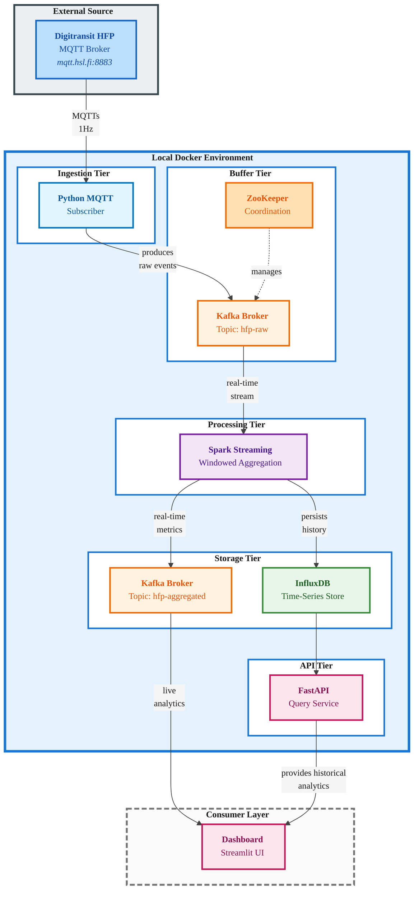

# Real-Time Public Transport Analytics Platform

A scalable real-time data processing backend for analyzing high-frequency vehicle positioning data from the [Helsinki Region Transport (HSL)](https://www.hsl.fi/en/hsl/open-data) system. The system ingests MQTT telemetry streams at one-second intervals, performs windowed aggregations using Apache Spark, and provides both real-time and historical analytics through a secured REST API. Built to meet the requirements of the task: *"Build a real-time data backend for a data-intensive application"*, as a part of the Data Engineering course (DLMDSEDE02) at Internationale Hochschule (IUBH) for my Master's in AI.

## Documentation

1. [Conception](docs/1-conception.md)
2. [Development](docs/2-development.md)
3. [Dashboard](docs/3-dashboard.md)

## Architecture

The system implements a lambda-like architecture with five microservices:



**Core Components**:
- **MQTT Ingestor**: Protocol translation from MQTT to Kafka with structured audit logging
- **Kafka**: Message buffering and distribution (topics: `hfp-raw`, `hfp-aggregated`)
- **Spark Streaming**: Windowed aggregations (10s tumbling, 60s sliding windows) with processing metrics
- **InfluxDB**: Time-series persistence for historical queries
- **FastAPI**: Secured REST interface with API key authentication and rate limiting
- **Dashboard**: Streamlit UI for real-time and historical data visualization

## Tech Stack

| Component | Technology | Version |
|-----------|-----------|---------|
| Data Ingestion | Python + Paho MQTT | 3.13 / 1.6.1 |
| Message Broker | Apache Kafka | 7.5.0 |
| Stream Processing | Apache Spark | 3.5.0 |
| Time-Series DB | InfluxDB | 2.7 |
| API Service | FastAPI + SlowAPI | 0.115.0 / 0.1.9 |
| Dashboard | Streamlit | 1.28.0 |
| Orchestration | Docker Compose | 3.8 |

## Prerequisites

- Docker (v20.10+) & Docker Compose (v2.0+)
- 8GB RAM, 20GB disk space
- Active internet connection


## Security Features

### API Authentication
- **API Key Authentication**: All data endpoints require an API key via `X-API-Key` header
- **Rate Limiting**: 100 requests/minute per endpoint to prevent abuse
- **Audit Logging**: All API requests logged with timestamps, parameters, and response codes

### Audit Logging
All components emit structured JSON logs for security and governance:
- **MQTT Ingestor**: Connection events, subscription confirmations, message statistics
- **Spark Processor**: Processing metrics, record counts, window computations
- **API Service**: Request/response audit trail with user identification


## Quick Start

### 1. Configure Security and Environment Variables

Before starting, create .env from the template:

```bash
cp .env.example .env
```

Then, set a secure API key in `.env`:

```bash
# Generate a secure random key (Linux/Mac)
openssl rand -hex 32

# Or use Python
python3 -c "import secrets; print(secrets.token_urlsafe(32))"
```

Edit `.env` and update:
```bash
API_KEY=your-secure-api-key-here
REQUIRE_AUTH=true
```

### 2. Start Services

```bash
# Start all services
docker-compose up -d

# Verify system health (no auth required)
curl http://localhost:8000/health

# View logs
docker-compose logs -f


```

### 3. Test Authentication

```bash
# Set your API key
export API_KEY="your-secure-api-key-here"

# Query with authentication
curl -H "X-API-Key: $API_KEY" http://localhost:8000/api/v1/routes
```

## Testing

```bash
# Unit tests
docker-compose run --rm mqtt-ingestor pytest tests/ -v
docker-compose run --rm spark-processor pytest tests/ -v
docker-compose run --rm api-service pytest tests/ -v
docker-compose run --rm dashboard pytest tests/ -v

# Integration tests
docker-compose -f docker-compose.test.yml down
docker-compose -f docker-compose.test.yml up --build --abort-on-container-exit
```

## API Endpoints

**Base URL**: `http://localhost:8000`

### Public Endpoints (No Authentication)
- `GET /health` - System health status
- `GET /` - API information

### Protected Endpoints (Require X-API-Key Header)
- `GET /api/v1/routes` - List available routes
- `GET /api/v1/metrics` - Query aggregated metrics
  - Query params: `route`, `direction`, `window_type`, `start_time`, `end_time`, `limit`
- `GET /api/v1/routes/{route}/stats` - Route-specific statistics

**Rate Limits**: 100 requests/minute per endpoint

**Interactive Documentation**: http://localhost:8000/docs
**Dashboard Interface**: http://localhost:8501

## Example API Queries

All examples assume the stack is running locally and you have set your API key:

```bash
# Set your API key
export API_KEY="your-secure-api-key-here"

# 1. Health check (no auth required)
curl "http://localhost:8000/health"

# 2. List all routes (requires auth)
curl -H "X-API-Key: $API_KEY" "http://localhost:8000/api/v1/routes"

# 3. Get recent metrics for a specific route
curl -H "X-API-Key: $API_KEY" "http://localhost:8000/api/v1/metrics?route=114&limit=1000"

# 4. Get only sliding-window metrics (60s window, 10s slide)
curl -H "X-API-Key: $API_KEY" "http://localhost:8000/api/v1/metrics?route=114&window_type=sliding_60s&limit=1000"

# 5. Get only tumbling-window metrics (10s non-overlapping)
curl -H "X-API-Key: $API_KEY" "http://localhost:8000/api/v1/metrics?route=114&window_type=tumbling_10s&limit=1000"

# 6. Filter by route, direction and time range (ISO 8601 timestamps, UTC)
curl -H "X-API-Key: $API_KEY" "http://localhost:8000/api/v1/metrics?route=114&direction=1&start_time=2025-12-20T12:00:00Z&end_time=2025-12-20T13:00:00Z&limit=500"

# 7. Get aggregated statistics for a single route
curl -H "X-API-Key: $API_KEY" "http://localhost:8000/api/v1/routes/114/stats?start_time=2025-12-20T12:00:00Z&end_time=2025-12-20T13:00:00Z"
```

## Project Structure

```
realtime-data-pipeline/
 ├── docker-compose.yml              # Service orchestration
 ├── docker-compose.test.yml         # Test environment
 ├── .env                            # Configuration (includes API_KEY)
 ├── mqtt-ingestor/                  # MQTT → Kafka ingestion
 ├── spark-processor/                # Stream processing & aggregation
 ├── api-service/                    # REST API for queries
 ├── dashboard/                       # Streamlit visualization UI
 ├── integration-tests/              # End-to-end tests
 └── docs/                           # Documentation
```

## Configuration

Edit `.env` to customize:

```bash
# Security Configuration (REQUIRED)
API_KEY=your-secure-random-key-here
REQUIRE_AUTH=true

# MQTT subscription filter
MQTT_TOPIC=/hfp/v2/journey/+/+/+/+/+/+/+/+/+/+/+/+/+/+/#

# Memory allocation
SPARK_DRIVER_MEMORY=2g
SPARK_EXECUTOR_MEMORY=2g

# Logging
LOG_LEVEL=INFO  # Options: DEBUG, INFO, WARN, ERROR
```


## Monitoring Audit Logs

View real-time audit logs:

```bash
# API request audit trail
docker-compose logs -f api-service | grep "event_type"

# MQTT ingestion statistics
docker-compose logs -f mqtt-ingestor | grep "event_type"

# Spark processing metrics
docker-compose logs -f spark-processor | grep "event_type"
```

Example audit log entry:
```json
{
  "timestamp": "2025-12-20T16:30:45.123Z",
  "service": "api-service",
  "event_type": "api_request",
  "method": "GET",
  "path": "/api/v1/metrics",
  "query_params": {"route": "114"},
  "client_ip": "172.18.0.1",
  "user_id": "authenticated",
  "response_code": 200
}
```

## Troubleshooting

### Authentication Issues

```bash
# Test authentication
curl -H "X-API-Key: wrong-key" http://localhost:8000/api/v1/routes
# Expected: 403 Forbidden

curl -H "X-API-Key: $API_KEY" http://localhost:8000/api/v1/routes
# Expected: 200 OK with route list
```

### Rate Limiting

If you hit rate limits, wait 60 seconds or adjust limits in `api-service/src/main.py`:
```python
@limiter.limit("100/minute")  # Increase as needed
```

### Log Access

```bash
# View all logs in one place
docker-compose logs -f

# Service-specific logs
docker-compose logs -f api-service
docker-compose logs -f mqtt-ingestor
docker-compose logs -f spark-processor


```

## Cleanup

```bash
# Stop services
docker-compose down

# Remove all data
docker-compose down -v


# Clean everything
docker-compose down -v --rmi all
```

