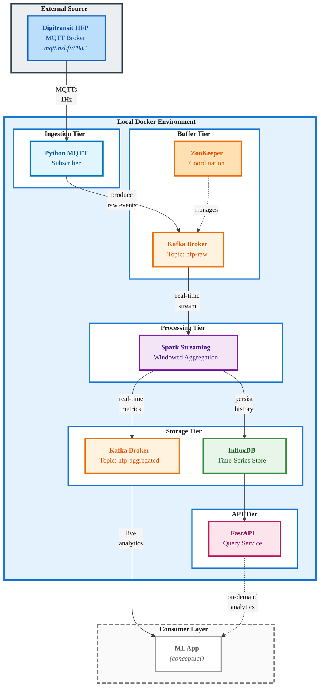

# Real-Time Public Transport Analytics Platform

A scalable real-time data processing backend for analyzing high-frequency vehicle positioning data from the [Helsinki Region Transport (HSL)](https://www.hsl.fi/en/hsl/open-data) system. The system ingests MQTT telemetry streams at one-second intervals, performs windowed aggregations using Apache Spark, and provides both real-time and historical analytics through a REST API. Built to meet the requirements of Task 2 *“Build a real-time data backend for a data-intensive application”* as a part of the Data Engineering course (DLMDSEDE02) at International University of Applied Sciences.


## Documentation

1. [Conception](docs/1-conception-phase.md)
2. [Development](docs/2-development-phase.md)

## Architecture

The system implements a lambda-like architecture with five microservices:





**Core Components**:
- **MQTT Ingestor**: Protocol translation from MQTT to Kafka
- **Kafka**: Message buffering and distribution (topics: `hfp-raw`, `hfp-aggregated`)
- **Spark Streaming**: Windowed aggregations (10s tumbling, 60s sliding windows)
- **InfluxDB**: Time-series persistence for historical queries
- **FastAPI**: REST interface for analytics queries

## Tech Stack

| Component | Technology | Version |
|-----------|-----------|---------|
| Data Ingestion | Python + Paho MQTT | 3.13 / 1.6.1 |
| Message Broker | Apache Kafka | 7.5.0 |
| Stream Processing | Apache Spark | 3.5.0 |
| Time-Series DB | InfluxDB | 2.7 |
| API Service | FastAPI | 0.115.0 |
| Orchestration | Docker Compose | 3.8 |

## Prerequisites

- Docker (v20.10+) & Docker Compose (v2.0+)
- 8GB RAM, 20GB disk space
- Active internet connection

## Quick Start

```
# Start all services
docker-compose up -d

# Verify system health
curl http://localhost:8000/health

# View logs
docker-compose logs -f

# Stop services
docker-compose down
```

## Testing

```
# Unit tests
docker-compose run --rm mqtt-ingestor pytest tests/ -v
docker-compose run --rm spark-processor pytest tests/ -v
docker-compose run --rm api-service pytest tests/ -v

# Integration tests
docker-compose -f docker-compose.test.yml down
docker-compose -f docker-compose.test.yml up --build --abort-on-container-exit
```

## API Endpoints

**Base URL**: `http://localhost:8000`

- `GET /health` - System health status
- `GET /api/v1/routes` - List available routes
- `GET /api/v1/metrics` - Query aggregated metrics
  - Query params: `route`, `direction`, `window_type`, `start_time`, `end_time`, `limit`
- `GET /api/v1/routes/{route}/stats` - Route-specific statistics

**Interactive Documentation**: http://localhost:8000/docs


## Example API Queries

All examples assume the stack is running locally via `docker-compose up -d`.

```
# 1. Health check (service + InfluxDB)
curl "http://localhost:8000/health"

# 2. List all routes with available data
curl "http://localhost:8000/api/v1/routes"

# 3. Get recent metrics for a specific route (any direction, any window type)
curl "http://localhost:8000/api/v1/metrics?route=114&limit=1000"

# 4. Get only sliding-window metrics (60s window, 10s slide)
curl "http://localhost:8000/api/v1/metrics?route=114&window_type=sliding_60s&limit=1000"

# 5. Get only tumbling-window metrics (10s non-overlapping)
curl "http://localhost:8000/api/v1/metrics?route=114&window_type=tumbling_10s&limit=1000"

# 6. Filter by route, direction and time range (ISO 8601 timestamps, UTC)
curl "http://localhost:8000/api/v1/metrics?route=114&direction=1&start_time=2025-12-20T12:00:00Z&end_time=2025-12-20T13:00:00Z&limit=500"

# 7. Get aggregated statistics for a single route
curl "http://localhost:8000/api/v1/routes/114/stats?start_time=2025-12-20T12:00:00Z&end_time=2025-12-20T13:00:00Z"
```

## Project Structure

```
realtime-data-pipeline/
├── docker-compose.yml              # Service orchestration
├── docker-compose.test.yml         # Test environment
├── .env                            # Configuration
├── mqtt-ingestor/                  # MQTT → Kafka ingestion
├── spark-processor/                # Stream processing & aggregation
├── api-service/                    # REST API for queries
├── integration-tests/              # End-to-end tests
└── docs                            # Documentation
```


## Configuration

Edit `.env` to customize:

```
# MQTT subscription filter
MQTT_TOPIC=/hfp/v2/journey/+/+/+/+/+/+/+/+/+/+/+/+/+/+/#

# Memory allocation
SPARK_DRIVER_MEMORY=2g
SPARK_EXECUTOR_MEMORY=2g
```

