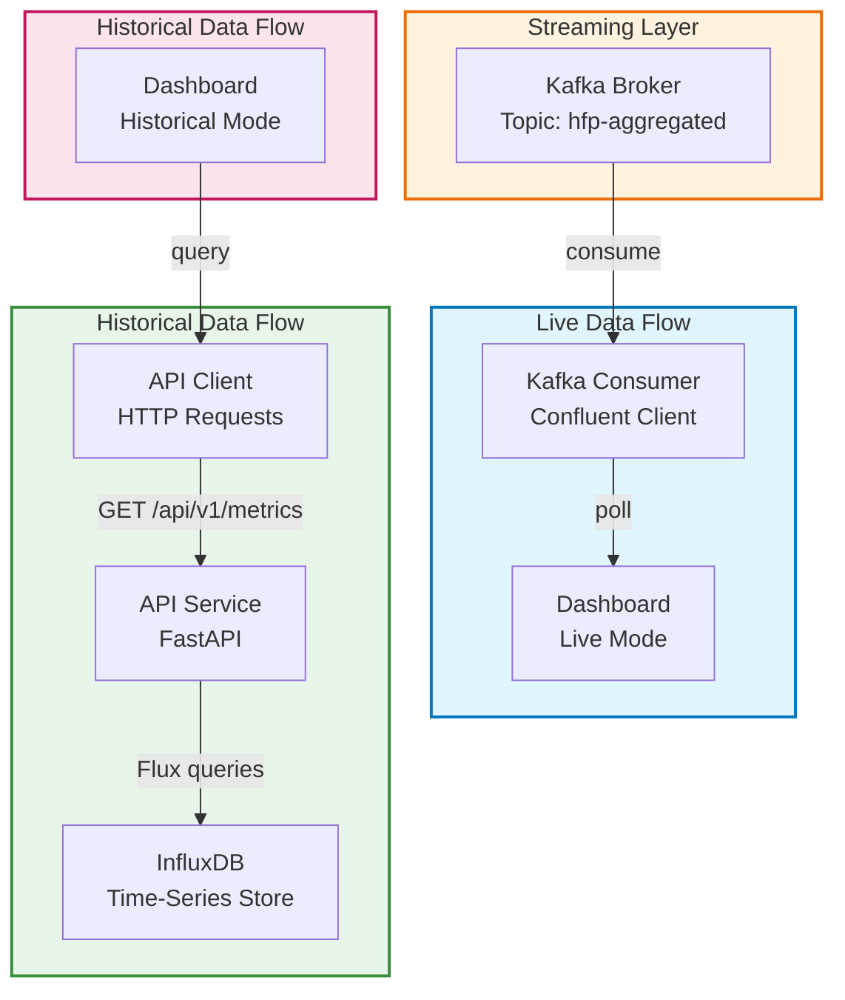

# Dashboard

## Abstract

The Dashboard is a Streamlit-based web application providing real-time and historical visualization for Helsinki Region Transport (HSL) vehicle position data. It serves as primary user-facing component of the real-time transport analytics platform, enabling monitoring of vehicle performance metrics through a basic interactive visualizations and configurable filters.

## System Overview

The Dashboard operates as a dual-mode interface, consuming data from both streaming and batch sources to provide comprehensive analytics.

### Data Sources

**Live Data Stream**: Consumes aggregated metrics from Apache Kafka (`hfp-aggregated` topic) with low-latency updates at 1-second polling interval. The implementation includes automatic reconnection handling with exponential backoff and JSON message parsing with error tolerance for malformed data.

**Historical API Queries**: Retrieves stored metrics from the REST API service with configurable time-range filtering (1 hour to 7 days), adjustable record limits (100-10,000 records), and route and direction filtering with optional window type selection.

### Functional Capabilities

#### Real-Time Monitoring

Live metrics display shows current vehicle count, active vehicles, average speed, and delay metrics. The system implements data caching to preserve latest values when no new data arrives, along with auto-refresh functionality using configurable polling intervals (2-30 seconds) for real-time data updates. Error handling ensures graceful degradation with informative status messages.

#### Historical Analytics

Time range selection provides slider-based configuration for hours (1-24) or days (1-7) range. Interactive visualizations use Plotly for trend analysis and pattern detection. The system includes a data table with raw data export and inspection capabilities plus sortable columns. Statistical summaries display aggregated metrics with contextual information.

#### Filtering Capabilities

Route selection populates a dynamic dropdown from available routes in the system. Direction filtering provides binary selection between direction 1 and 2. Conditional dropdowns differ by mode: Live mode includes "All Routes" and "All Directions" options, while Historical mode requires specific route and direction selection for query optimization.

### User Interface Components

The dashboard implements a Streamlit UI structure with two primary areas.

**Sidebar Controls**: Route number selection, direction selection (1 or 2), data source toggle (Live/Historical), time range configuration (Historical mode only), and auto-refresh controls (Live mode only).

**Main Display Area**: Metrics cards for key performance indicators, tabbed charts for vehicle count/speed/delay, data table with sorting capabilities, and status messages for data availability and errors.

## Implementation Details

### Architecture



### Core Modules

**Kafka Consumer** (`src/kafka_consumer.py`) provides Confluent Kafka client initialization with configurable group ID, topic subscription and message polling with timeout handling, JSON decoding with error logging for malformed messages, and connection management with retry logic and graceful shutdown.

**API Client** (`src/api_client.py`) implements HTTP request handling with API key authentication, parameter serialization for time ranges (ISO 8601 format), error recovery with request logging and timeout management (30s), and header generation with content-type negotiation.

**Configuration Management** (`src/config.py`) handles environment variable loading with default value fallback, service endpoint configuration (Kafka, API), API key management from environment variables, and logging level control (DEBUG, INFO, WARN, ERROR).

**Main Application** (`src/app.py`) manages Streamlit page configuration and layout, session state management for data persistence, data filtering logic by route and direction, visualization rendering with Plotly integration, and auto-refresh loop handling with configurable intervals.

## Data Flow

### Live Data Mode

The dashboard polls the Kafka topic at configurable intervals (default: 5 seconds). The consumer retrieves the latest messages in batches up to 100. Messages are decoded from JSON and filtered by route and direction parameters. Data displays in metrics cards and time-series charts, and the latest data is cached in Streamlit session state for persistence. The page automatically refreshes based on the configured interval.

### Historical Data Mode

Users select route, direction, and time range parameters. The API client constructs query parameters using ISO 8601 timestamps and sends an HTTP GET request to the `/api/v1/metrics` endpoint. The JSON response is parsed and validated against the expected schema. Data is transformed into a Pandas DataFrame for manipulation. Statistics are calculated and charts rendered. The raw data table is populated for user inspection.

## Error Handling Strategy

The dashboard implements comprehensive error handling across multiple components. Kafka connection failures trigger retry logic with exponential backoff and connection validation. JSON decode errors are logged at the message level without causing system failure. API timeouts are handled with an extended 30-second timeout, user notification, and retry capability. Data filtering gracefully handles missing or null values in the dataset. Empty results display informative messages when no data matches the selected filters. Network issues trigger connection status indicators and graceful degradation.

## Performance Considerations

Message batching ensures Kafka polls retrieve up to 100 messages per cycle to balance data freshness with resource utilization. Data caching in session state reduces redundant API calls and improves response times. Selective rendering ensures charts only render when data is available to avoid unnecessary computations. Query limits default to 1,000 records to prevent excessive data transfer and memory usage. Polling optimization uses configurable intervals to prevent excessive load on the Kafka broker.

## Configuration

Environment variables for dashboard customization include:

```bash
# Kafka Configuration
KAFKA_BOOTSTRAP_SERVERS=kafka:9093
KAFKA_AGGREGATED_TOPIC=hfp-aggregated

# API Configuration
API_URL=http://api-service:8000
API_KEY=your-api-key-here

# Logging Configuration
LOG_LEVEL=INFO
```

## Testing

Unit tests verify dashboard component functionality. Configuration tests validate default and custom environment variable loading. API client tests verify request handling, header generation, authentication, and error scenarios. Kafka consumer tests validate initialization, connection success/failure, and graceful closure. Data filtering tests confirm route and direction filter logic validation.

Test execution:

```bash
docker-compose run --rm dashboard pytest tests/ -v
```

## Future Enhancements

Potential improvements for dashboard functionality include advanced filtering with date range pickers and calendar UI for precise time selection, data export with CSV/Excel download functionality for offline analysis, alerting with threshold-based notifications for delays, anomalies, or service disruptions, multi-route comparison with side-by-side route performance views for comparative analysis, geospatial visualization with map-based vehicle tracking integration and real-time positioning, and user preferences for saved filter configurations and custom dashboard layouts.
